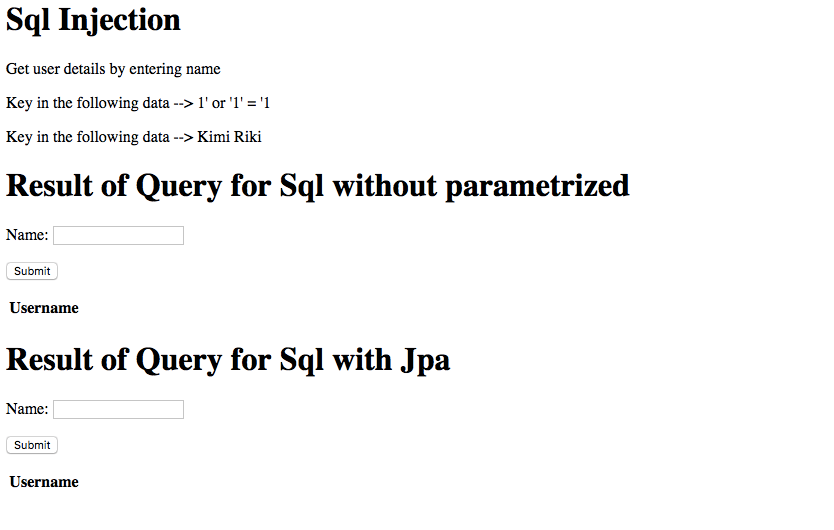

Cybersecurity Project Report: Explaining web vulnerability and how to fix identified security flaws
------

## Prerequisite

1. IntelliJ Idea Community Edition
2. JDK 8
3. Maven 3.3.x

## Guide to setup the project
1. https://github.com/calsaviour/cybersecuritybase-project.git
2. cd into the project folder
3. run the command mvn dependency:resolve
4. run the command mvn spring-boot:run
4. Browse localhost:8080


## Sql Injection example
Login to the web, first in the list is Sql Injection. Click on the Sql Injection link.
A screen as below will be prompt in your browser


There are 2 forms in the page, the first form is where the input is not sanitized whereas the second form the input is sanitized


Code in the first form
```
    @Transactional
    @RequestMapping(value = "/account", method = RequestMethod.POST)
    public String getUser(@RequestParam String name) throws SQLException {
        String databaseAddress = "jdbc:h2:mem:testdb";
        Connection connection = DriverManager.getConnection(databaseAddress, "sa", "");
        String sqlQuery = "select * from Account where username=" + "'" + name + "'";
        ResultSet resultSet = connection.createStatement().executeQuery(sqlQuery);
        accountList = new ArrayList<>();
        while (resultSet.next()) {
            String username = resultSet.getString("username");
            Account account = new Account();
            account.setUsername(username);
            accountList.add(account);
        }

        resultSet.close();
        connection.close();
        return "redirect:/account";
    }

```

Code in the second form
```
    @Transactional
    @RequestMapping(value = "/account_jpa", method = RequestMethod.POST)
    public String getUserJpa(@RequestParam String name) throws SQLException {
        Account account = accountRepository.findByUsername(name);

        if (account == null) return "error";

        accountJpaList = new ArrayList<>();
        accountJpaList.add(account);
        return "redirect:/account";
    }

```

## Cross Site Scripting
Login to the web, first in the list is Sql Injection. Click on the Cross Site Scripting link.
A screen as below will be prompt in your browser

There are 2 tables. The first table does not sanitize the input by using the
 attribute th:utext. The second table sanitize the input by using attribute th:text
 
 
First Table

```

<table>
    <tr>
        <th>Blogs</th>
    </tr>
    <tr th:each="blog : ${blogs}">
        <td th:text="${blog.name}"></td>
        <td th:utext="${blog.comment}"></td>
    </tr>
</table>

```

Second Table

```
<table>
    <tr>
        <th>Blogs</th>
    </tr>
    <tr th:each="blog : ${blogs}">
        <td th:text="${blog.name}"></td>
        <td th:text="${blog.comment}"></td>
    </tr>
</table>
```

